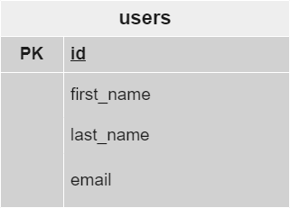

# 💻 Samsung Developer Women

## 🏛️ Bejob - Camilo Jose Cela University

## 📜 Full Stack Development. Level 3. Ed 2022

### 🎓 PHP Lab: Newsletter Subscription app

## 🤵 Mentor

Angel Garcia Lupiañez

## ✍ Instructions

1. Create a form, with fields 'id, first name, last name, and email'.
2. This form should be connected to a DB that must be updated with each record inserted from the form.
3. The id field should be Primary Key and auto incremented.
4. The fields name, last name, and email should be Varchar(20).
5. Show connection states.

### 🧮 Table schema

### 🛠 Tools

| Tool       | Version |
| ---------- | ------- |
| HTML       | 5       |
| CSS        | 3       |
| Bootstrap  | 5       |
|PHP         |7.4.27   |
|MySQL       |mysqlnd 7.4.27    |
| phpMyAdmin SQL Dump  |5.1.1   |
| Visual Studio Code   | 1.78.2 |
|Git         |2.40.1   |
 |Github repository| |

### 🔑 License

- [MIT License](LICENSE)
